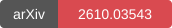

<p align="center">
  
</p>

# Joint–Marginal Distribution Matching for Few-Step Video Generation

<p align="center">
  <a href="https://johnzhan2023.github.io/DuoMatching/"></a>
  <a href="https://arxiv.org/abs/2610.03543"></a>
  <a href="https://huggingface.co/JohnZhan/DuoMatching"></a>
</p>

## Abstract

Streaming video generation has benefited from distribution matching distillation (DMD), which matches the joint distribution of video frames to a video teacher’s approximation of the real video distribution. Although this joint matching mitigates drift during autoregressive rollouts, limitations remain in visual quality and semantic alignment. To address these limitations, we propose DuoMatching, a distribution matching framework that approximates the real video distribution through a unified joint-marginal formulation. On top of existing joint matching formulations, the additional marginal matching objective provides dedicated frame-level supervision from an image generator, transferring complementary visual and semantic priors from it. To apply this frame-level supervision in video generation, we introduce LatentBridge to resolve the latent representation mismatch between the video student and the image teacher. Latent Variation Sampling further distributes such frame-level supervision across distinct temporal segments, reducing redundancy. Experiments demonstrate that DuoMatching improves visual quality, composition, and semantic alignment while largely preserving motion dynamics. Human evaluations show overall preference rates above 80% against all evaluated baselines.

## Installation

Use Python 3.10 and a CUDA-capable NVIDIA GPU. Run commands from this repository's
root. The pinned environment uses PyTorch 2.6 / torchvision 0.21.

```bash
git clone --branch main https://github.com/JohnZhan2023/DuoMatching.git
cd DuoMatching
conda create -n duomatching python=3.10 -y
conda activate duomatching
pip install -r requirements.txt
pip install flash-attn==2.8.3.post1 --no-build-isolation
pip install -e . --no-deps
```

FlashAttention requires a compatible CUDA toolkit and compiler. The causal
backbone also uses PyTorch FlexAttention. Video generation requires CUDA.

## Download weights

```bash
hf download Wan-AI/Wan2.1-T2V-1.3B --local-dir wan_models/Wan2.1-T2V-1.3B
hf download JohnZhan/DuoMatching --local-dir checkpoints/DuoMatching
```

The released checkpoint is a 2-step DuoMatching model distilled from
Wan2.1-T2V-14B.

## Generate a video

Put one prompt per line in a UTF-8 text file, or use `prompts/demos.txt`:

```bash
python inference.py \
  --config_path configs/duomatching_inference.yaml \
  --checkpoint_path checkpoints/DuoMatching/model.pt \
  --use_ema \
  --data_path prompts/demos.txt \
  --output_folder outputs/demo \
  --end_index 1 \
  --num_output_frames 21 \
  --seed 0
```

## Training

Download the video teacher, image teacher, and causal distillation initialization:

```bash
hf download Wan-AI/Wan2.1-T2V-14B --local-dir wan_models/Wan2.1-T2V-14B
hf download Qwen/Qwen-Image --local-dir models/Qwen-Image
hf download zhuhz22/Causal-Forcing framewise/causal_cd.pt --local-dir checkpoints
hf download gdhe17/Self-Forcing vidprom_filtered_extended.txt --local-dir prompts
```

Training uses the same VidProM prompts as Causal Forcing. After downloading
`prompts/vidprom_filtered_extended.txt` above, launch training:

```bash
torchrun --standalone --nproc_per_node=8 train.py \
  --config_path configs/duomatching_train.yaml \
  --logdir duomatching \
  --disable-wandb
```

### Latent Variation Sampling

Latent Variation Sampling identifies strong transitions in the video latent
sequence, partitions it into temporal segments, and randomly samples one frame
from each segment. It is the default frame sampling strategy through
`qwen_image_teacher.frame_sampling: transition_segments`. You can also use
`qwen_image_teacher.frame_sampling: random` for convenience.

### LatentBridge

Pretrained LatentBridge weights are included in the DuoMatching model repository.
To download only these weights:

```bash
hf download JohnZhan/DuoMatching --include 'latent_bridge/*' \
  --local-dir checkpoints/DuoMatching
```

To train LatentBridge, create a JSONL manifest containing videos:

```json
{"video": "/path/to/video.mp4", "id": "example"}
```

Set `data.manifest` in `configs/latent_bridge/prepare_480p.yaml`, then prepare
the latent cache and train:

```bash
torchrun --standalone --nproc_per_node=8 \
  scripts/latent_bridge/prepare_latent_cache.py \
  --config configs/latent_bridge/prepare_480p.yaml

accelerate launch --num_processes 8 scripts/latent_bridge/train_adapter.py \
  --config configs/latent_bridge/train_480p_30k.yaml
```

Set `DUOMATCHING_ADAPTER_ROOT` to the resulting checkpoint directory when using
the trained LatentBridge for video distillation.

## Paths

All default paths are relative to the repository root. You can override
`DUOMATCHING_WAN_ROOT`, `DUOMATCHING_QWEN_ROOT`, `DUOMATCHING_ADAPTER_ROOT`,
`DUOMATCHING_INIT_CKPT`, `DUOMATCHING_TRAIN_PROMPTS`, and
`DUOMATCHING_OUTPUT_ROOT` with environment variables.

## Acknowledgements and license

Built on [Causal Forcing](https://github.com/thu-ml/Causal-Forcing),
[Self Forcing](https://github.com/guandeh17/Self-Forcing),
[Wan2.1](https://github.com/Wan-Video/Wan2.1), and
[Qwen-Image](https://github.com/QwenLM/Qwen-Image).
See [NOTICE](NOTICE) for source provenance and retained attribution.
Code is distributed under [Apache-2.0](LICENSE). Upstream model weights and
datasets retain their respective licenses and terms.
